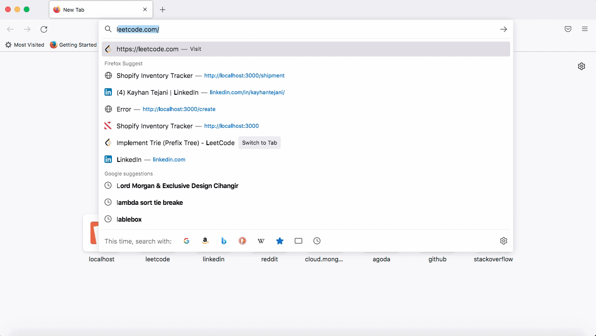

# Shopify Fall 2022 Backend Developer Intern Challenge

## Abstract

This is an inventory tracking system project as part of my application for Shopify's Fall 2022 Backend Intern role. The user is able to create, update and delete
items as well as view a list of them.

**Selected Feature Requirement:**
The user is able to create 'shipments' and assign inventory to them for existing items. Once a shipment is created, it is "Processing".
To 'complete' the shipment, the user can click the check mark right beside the shipment entry which will adjust the inventory of the item appropriately.

This project is made with a frontend of HTML + CSS + Bootstrap, a backend of JavaScript + Express + Handlebars and a MongoDB database to store items and shipments.



## Local Configuration

You can run this project locally through these steps:

1. Clone the repository to your machine

        $ git clone https://github.com/KayhanTejani/shopify-intern-challenge.git
        
2. Change into the project directory

        $ cd shopify-intern-challenge
        
3. Install all the required Node.js dependencies

        $ npm install
        
4. Run the web app

        $ node app.js

## Data Model

The application stores items and shipments

**Items**
* Contain name, category, quantity and price

An example item:

```javascript
{
  name: "Shirt",
  category: "Clothing",
  quantity: 45,
  price: 20
}
```

**Shipments**
* Contain name, category, quantity, price and status

An example shipment:

```javascript
{
  name: "Apple",
  category: "Fruit",
  quantity: 15,
  price: 3,
  status: "Processing"
}
```

## User Stories

1. As a user, I can create an item and store it in my inventory
2. As a user, I can update any of the info attached with an item entry
3. As a user, I can delete items from my inventory
4. As a user, I can see a list of items in my inventory
5. As a user, I can create a shipment for an existing item in my inventory
6. As a user, I can complete a shipment to update and adjust the item quantity in my inventory
